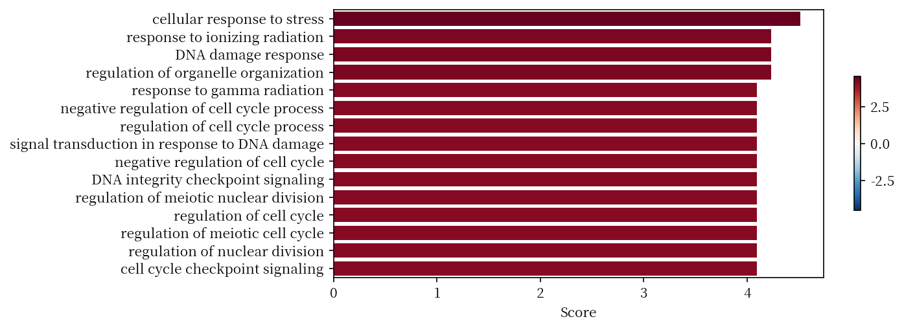
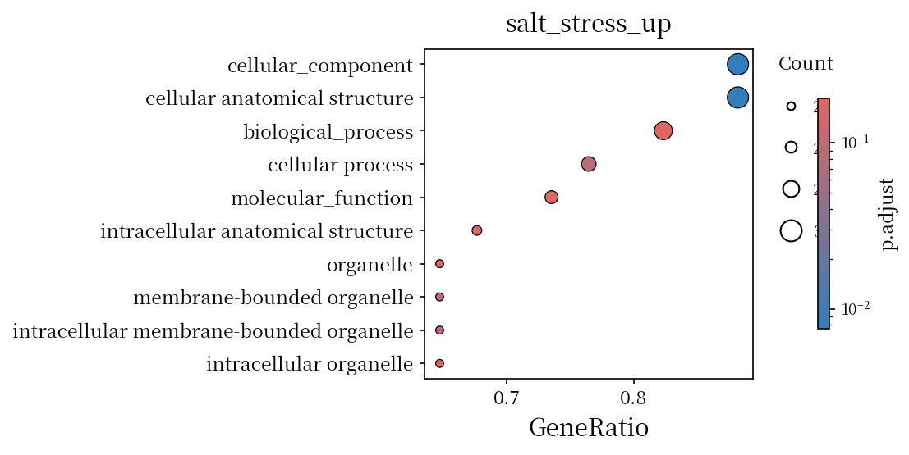
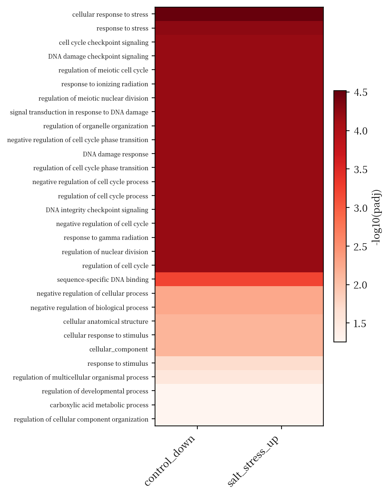
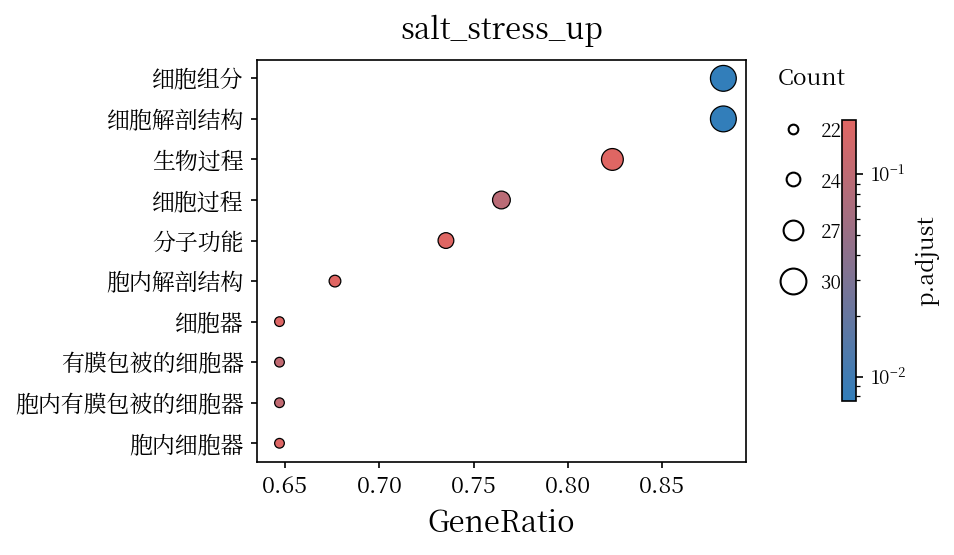
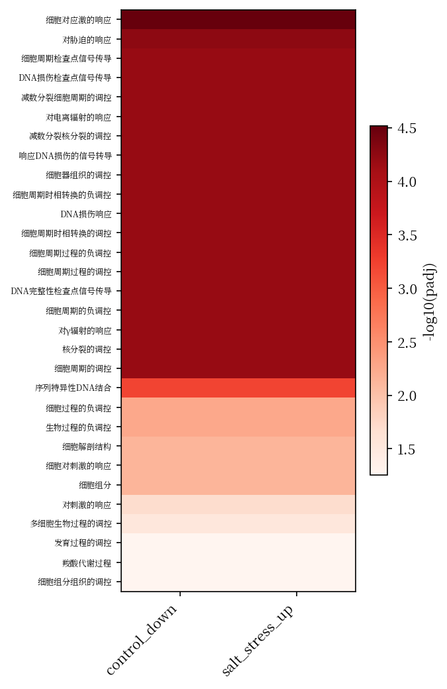

English | [简体中文](README.zh.md)

# qenrich

Quick gene enrichment tools (GO / KEGG / Pfam / InterPro) for non-model organisms. ORA uses a two-sided Fisher exact test with BH correction; weighted columns run GSEA.

Annotation files are auto-detected, parsed once and cached. A gene list holds one gene set per column, and one run tests every column.

## Install

```bash
git clone https://github.com/WWz33/qenrich.git
cd qenrich
pip install -e .            # decoupler and other dependencies install automatically
```

## Usage

```bash
# parse + cache + enrich go
qenrich -i emapper.annotations.tsv --genelist gene_list.txt

# KEGG from the same file
qenrich -i emapper.annotations.tsv -f kegg --genelist gene_list.txt

# reuse a parsed object
qenrich -i go --genelist gene_list.txt --db qenrich_db/

# parse into an object db for reuse
qenrich parse emapper.annotations.tsv -o qenrich_db/

# GO propagation + term names (on by default, from the bundled go-basic.obo)
qenrich -i emapper.annotations.tsv --genelist gene_list.txt

# use a different/newer OBO release
qenrich -i emapper.annotations.tsv --genelist gene_list.txt --obo go-basic.obo

# skip propagation (raw annotations, ids instead of names)
qenrich -i emapper.annotations.tsv --genelist gene_list.txt --no-obo

# collapse parents with significant children; name KEGG/Pfam; strip .N suffixes
qenrich -i go --genelist gene_list.txt --drop-parents \
        --zh ko_ids.txt --strip-suffix

# eggNOG: one annotation level
qenrich -i emapper.annotations.tsv --eggnog-lvl 2759 --genelist gene_list.txt

# custom background + plots
qenrich -i go --genelist gene_list.txt --bg universe.txt -o out/ --plot

# run only selected gene-list columns (names or 1-based indices)
qenrich -i emapper.annotations.tsv --genelist gene_list.txt -c salt_stress_up,2

# ignore an existing cache: parse from scratch, write nothing
qenrich -i emapper.annotations.tsv --genelist gene_list.txt --no-cache

# one-sided over-representation, the test clusterProfiler's enrichGO computes
qenrich -i emapper.annotations.tsv --genelist gene_list.txt --alternative greater
```

`gene_list.txt` is whitespace- or tab-delimited, one gene set per column. Headers are auto-detected, and their names become the set names (`set1..setN` when absent). Columns of `gene,weight` pairs (second field numeric, e.g. log2FC) go to GSEA; plain ID columns go to ORA. `.gz` works as is.

Plain ID columns:

```
salt_stress_up  control_down
Glyma.01G000100 Glyma.01G000400
Glyma.01G000200 Glyma.01G000500
Glyma.01G000300 Glyma.01G000600
```

Weighted column (GSEA):

```
deg_up
Glyma.01G000100,3.2
Glyma.01G000200,1.8
Glyma.01G000300,-0.5
```

Each set is written to `<set>_enrichment.tsv` (ORA) or `<set>_gsea.tsv` (GSEA) and merged into `summary.tsv`, ordered by `padj`. English `name` comes from the bundled OBO. Chinese appears only on request: `--zh` adds a `name_zh` column and Chinese plot labels; `--zh table.tsv` merges a custom table (col 2 English, col 3 Chinese) for ids the OBO does not cover (KEGG, Pfam, InterPro) or overrides entries:

```
term          name                          name_zh          term_size  overlap  genes           pvalue    log_or  padj
GO:0006950    response to stress            对胁迫的响应      18         1        glyma…Gm…0028… 4.02e-07  -3.53   1.75e-05
GO:0043565    sequence-specific DNA binding  序列特异性DNA结合 14         1        glyma…Gm…0032… 4.52e-05  -2.97   0.000196
GO:0048519    negative regulation of bio...  生物过程的负调控   17         3        glyma…Gm…0031… 4.41e-04  -2.2    0.00174
```

`--style` selects the plotting style:





Labels follow `--labels {name,id}` (default `name`).

## Chinese labels

Opt-in via `--zh`: it adds a `name_zh` column and switches plot labels to Chinese. The table (`go_zh.tsv`, 38 092 rows) is an LLM translation of every go-basic.obo term name, not human-reviewed; verify before citing. A `go_zh.tsv` in the working directory overrides the bundled one. `--zh table.tsv` extends it to other id spaces (KEGG, Pfam) or overrides entries:

```bash
qenrich -i emapper.annotations.tsv --genelist gene_list.txt \
        --zh --plot --style enrichplot
```




## Supported annotation formats

| Format | Detection | Objects |
|---|---|---|
| eggNOG-mapper `*.emapper.annotations.tsv` | `#query` header + `GOs` column | go, kegg, pathway, pfam, cog |
| InterProScan TSV (`--goterms`) | no header, column 2 = 32-char md5 | go, interpro, pfam |
| Blast2GO `.annot` | 4 columns, column 3 = `InterPro` | go, interpro |
| Blast2GO / OmicsBox tabular | `Sequence Name` header | go |
| PANNZER2 `.out` | `qpid`/`qseqid` header | go |
| Trinotate report | `gene_id` + `transcript_id` header | go |
| GAF 2.x (TAIR / UniProt / Ensembl Plants) | `!` header, 15 cols, GO col 5 | go |
| GFF3 `Ontology_term=` | `##gff-version`; mRNA rolls up to gene | go, interpro |
| KofamKOALA / GhostKOALA / KAAS | column 2 = `K\d{5}` | kegg |
| Generic (gene + ID columns) | fallback | go/kegg/pfam/interpro by regex |
| Standard net TSV | `source`,`target` header | net |

Force with `--format` if detection fails (choices printed on error).

`data/format/` holds one example per format:

```bash
qenrich -i data/format/emapper.annotations.tsv \
        --genelist data/format/gene_list.txt --tmin 3
```

## Notes

`--tmin` (default 5) drops terms with too few targets; lower for small annotations.

`--alternative` picks the ORA test. The default `two-sided` counts depletion as
well as enrichment. `greater` runs the one-sided over-representation test that
clusterProfiler's `enrichGO` uses, which gives smaller p-values. To tell enrichment
from depletion, read the sign of `log_or`.

qenrich caches the parsed annotation next to the file (`<file>.qenrich/`). A change
to the file, the format or the qenrich version makes the next run parse again.
`--no-cache` skips the cache: it reads nothing and writes nothing.

`--padj` (default 0.05) sets the cutoff for counting significant terms and, with
`--drop-parents`, for collapsing parents. It does **not** filter `summary.tsv` or
the per-set tables; those keep every tested term, sorted by padj.

`--bg` restricts the ORA background. GSEA uses the ranked list as given, so `--bg`
does not affect `<set>_gsea.tsv` and qenrich prints a warning. GSEA rows follow
clusterProfiler: `Count` is the leading-edge size and `GeneRatio` = `Count`/`setSize`.

For GO, qenrich propagates the DAG with the bundled `go-basic.obo` (2026-07-26,
`src/qenrich/data/`) and reads term names from it. `--obo` points at another
release; `--no-obo` turns propagation off. Annotations to a retired term follow its
`replaced_by` target. Terms the OBO does not list are dropped with a warning on
stderr, which happens when the annotation predates the OBO release.
